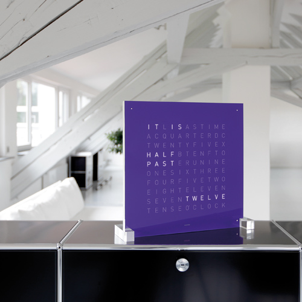

# ${this.title}

The QlockTwo, made in Germany, is a beautiful device.

I set out to steal some of that beauty and made a&nbsp;version of the&nbsp;<a href="https://dtrejo.com/qlock/qlock.html" target="_blank">QlockTwo using jQuery</a>. You can see it live&nbsp;<a href="https://dtrejo.com/qlock/qlock.html" target="_blank">right here</a>.

Building this clock was a ton of fun. It took me a couple of days, and I learned about the relativity of time (ooh sophisticated).

Here are some fancy&nbsp;psychological&nbsp;things that go on when you use the clock:

The first half of the hour creeps along &mdash; you don't notice the dots as much as the words, so most of the time it's later than what you see in words. The only way to stay accurate is to pay lots of attention to the dots, which requires more thought and means it takes you longer to read the clock.

The second half of the hour races. The words are always either in synced with or ahead of the real-time. This means it that you'll finish meetings earlier, and be more punctual because you'll give yourself extra time to get places. Just make sure you always schedule your appointments on the hour.

Technical Details

I select the words to be highlighted in a really janky way. It is very dependent on the structure of the table (yeah I tried to use divs, but I don't have the skill to keep all the words aligned horizontally and vertically and keep everything square too). Here's roughly how the code works:

<ul>
<li style="margin-left: 15px;">Javascript asks for the time&nbsp;</li>
<li style="margin-left: 15px;">Time is transformed into words by a for loop which used to be a GIGANTIC composite switch and if else statement. It was a mess.</li>
<li style="margin-left: 15px;">The text in all the table cells is put together into one long string. There is a one-to-one relationship between the table cells and the letters in the string. This means that if I match the word "OCLOCK" in the string, and the O in OCLOCK is the 50th character in the string, then I know I can just light up the 50th table cell and it will contain the "O." That wasn't the most clear way of saying things. Here's how it goes: I want to highlight OCLOCK, the code finds the position of OCLOCK in the string, then highlights the table cells in that position.&nbsp;</li>
<li style="margin-left: 15px;">Every 400 milliseconds the clock's face is refreshed. It is important to me that the clock change times in a smooth manner, and it is important that the clock light up in a visible way when you load the page. To achieve a smooth fadein, there is a css transition of .12 seconds. This makes things smooth when the clock changes times. The 400 millisecond fadein leaves the page time to load when you first fire it up, so you get to experience the initial glow when the clock lights up.&nbsp;</li>
<li style="margin-left: 15px;">Now you might be thinking, if the CLOCK REFRESHES EVERY 400 MILLISECONDS THEN WHY ISN'T IT FLASHING LIKE CRAAAAAZYYY?? That's how it was initially, and it was ugly as sin (if you consider sin ugly). Here's the solution: compare the previously lighted letters with the new ones that need to be lighted, unlight the ones not present in the new list, and then light up the new ones. This turns out to be a bit complicated and it turns out Venn diagrams made with water colors are a key tool of the modern-day programmer.&nbsp;</li>
<li style="margin-left: 15px;">What other cool stuff does the clock have in it? I stole a glow from&nbsp;<a href="http://midtonedesign.com" target="_blank">midtonedesign.com</a>, which adds the halo behind the clock (cheers Jonotan). I also chose a font from the google font directory that mimics the QlockTwo's font quite well. And of course I threw in some text-shadows to make things glow. Mandatory.</li>
</ul>

### Conclusion

&nbsp;jQuery is tons of fun to work with, and the&nbsp;<a href="http://webchat.freenode.net/?channels=jquery" target="_blank">#jquery channel</a>&nbsp;is full of helpful people. I emailed QlockTwo and apparently <a href="https://dtrejo.com/qlock/qlock.html">my version</a> is a "Nice Application with JQuery and CSS!"

The time distorting aspects of the clock are quite fun, so make sure to put one up in your office so you can wrap up boring meetings more quickly.

Cheers,

David

&nbsp;

