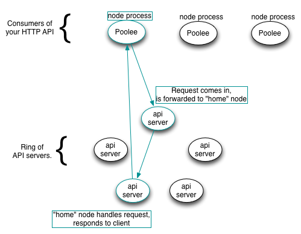

# ${this.title}

*Note: written in August 2012 during my summer at Voxer. `sky` has been released
as [zag][11]!*

Voxer believes that any single point of failure is bad. Very bad (this is why we
use riak). To achieve this, we've written a couple libraries to allow node
processes to communicate across machines and in concert. The first is
[poolee][1] by [Danny Coates][2] which does http load balancing on the client,
and the second is `ring`, which organizes processes that compose a service
into a cooperating whole (each process owns part of the keyspace, and thus part
of the work).

Here's how this looks:

Requests emanate from clients via [poolee][1], which has a list of all API
servers. Poolee chooses a random API server to speak with, and will stop talking
to the API server if it becomes unresponsive. Health checks on unresponsive
servers are performed with using exponential backoff (e.g. 1 second, 8 seconds,
16 seconds, etc), so as not to flood the network.

The ring of API servers kicks in! Each client request has a distinguishing
characteristic (e.g. geographic region), which dictates a specific API server as
the "home" or "owner" of that data, and it is tasked with responding to that
request. You may have noticed that poolee chooses a *random* node, but it turns
our that this random node knows it is not the owner of the request, and can
forward it to the true "home" node of that request.

`ring` is consistent, which means that when an API server goes down, the other
servers will fill in for the downed server without changing the homes of data
stored on any nodes other than one neighboring node. The efficiency of home
re-shuffling is what makes the ring consistent. If this doesn't make sense, it is
because it's difficult to explain, wikipedia does a better job of explaining
[consistent hash rings][4].

## Failure
Poolee and ring work together and allow us to do rolling restarts without
service interruption, restart single machines when SSL has memory leaks,
and remove machines from our clusters.

Thus, Voxer achieves a no single point of failure architecture using the
power of [node.js][6].

Thanks for reading! 
[David Trejo][8] 
[@ddtrejo][9] & [DTrejo on github][10]

[1]:https://github.com/dannycoates/poolee
[2]:https://github.com/dannycoates
[4]:https://en.wikipedia.org/wiki/Consistent_hashing
[6]:http://nodejs.org

[8]:https://dtrejo.com
[9]:https://twitter.com/ddtrejo
[10]:https://github.com/DTrejo
[11]:http://voxer.github.io/zag/
